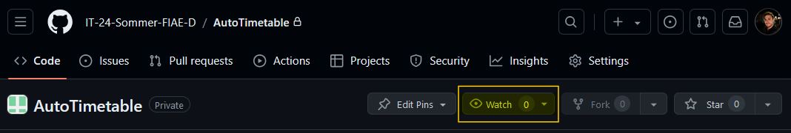
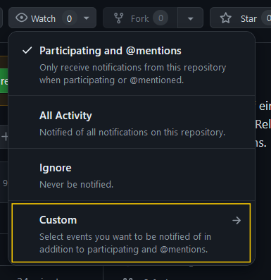
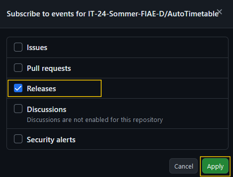

# Auto Timetable Fetcher

Das Python-Script **Auto Timetable Fetcher** ist ein Tool, das es ermöglicht, den Stundenplan aus dem Stundenplan-Portal der Viona automatisiert auf Änderungen zu überprüfen und bei Bedarf einen neuen Release zu erstellen.
Es ist möglich sich auf diesen Release zu registrieren und somit bei Änderungen im Stundenplan benachrichtigt zu werden.

## Weitere Informationen

- [Hier geht's zum neuesten Release..](https://github.com/IT-24-Sommer-FIAE-D/AutoTimetable/releases/latest)
- [Workflow Interface](./docs/Workflow%20Interface)

## Auf neues Release registrieren

1. Um sich auf ein neues Release zu registreren, muss man oben auf `Watch` klicken:

2. Anschließend wählt man `Custom` aus:

3. Nun kann man explizit `Releases` auswählen und bestätigt dies mit `Apply`:

4. **Jetzt erhält man eine Benachrichtigung, sobald ein neues Release veröffentlicht wird und ist somit immer auf dem neuesten Stand!**

## Development

Klone dieses Repository mit `git clone https://github.com/IT-24-Sommer-FIAE-D/AutoTimetable.git` und wechsle in das Verzeichnis mit `cd AutoTimetable`.

Installiere nun alle abhängigkeiten mit `pip install -r requirements.txt` und führe das Skript mit `python main.py` aus. Bitte vermeide es, etwaige lokal heruntergeladene Dateien zu pushen.