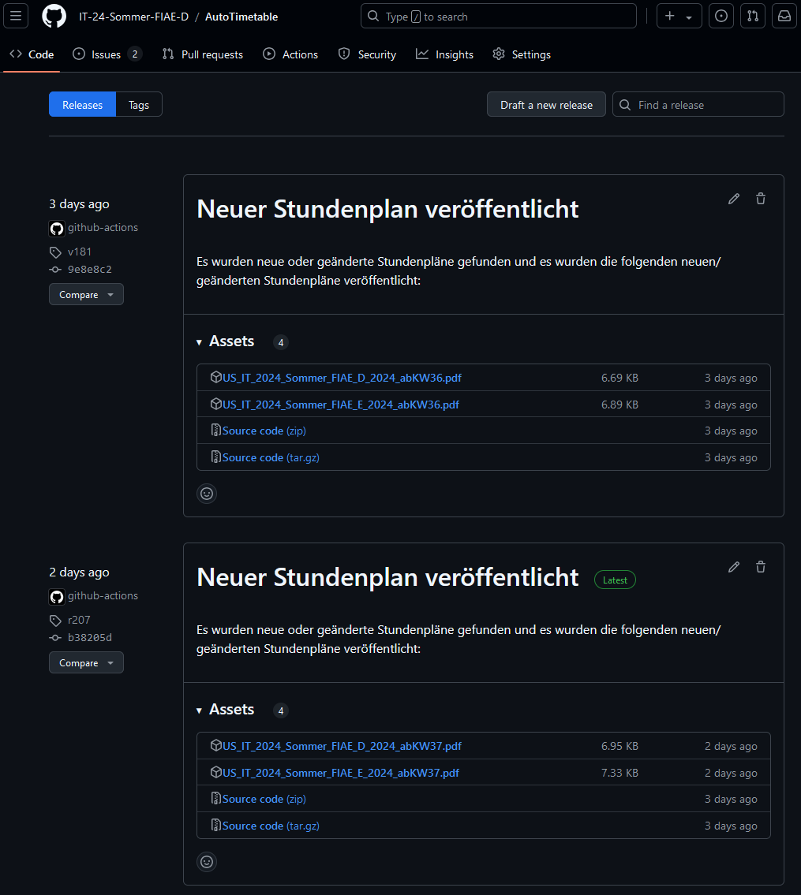

# Workflow Interface

Innerhalb dieses Github-Repositories ist ein **Workflow** [¹](#fußnote-1) implementiert, welcher das Python-Skript `main.py` jede Stunde ausführt. 

Hierbei erwartet der Workflow, dass das Skript `main.py` und die Datei `requirements.txt` im Repository vorhanden sind. Das Skript `main.py` wird mit dem Befehl `python main.py` ausgeführt.

Hierbei wird die Rückgabe des Skripts ausgewertet. Wenn das Skript erfolgreich ausgeführt wurde (Exit-Code 0), erwartet der Workflow, dass neue Stundenpläne im Ordner `docs/` erstellt oder aktualisiert wurden. 

Diese Dateien werden dann automatisch als Release erstellt und dabei angehängt [²](#fußnote-2).

Dies kann beispielsweise wie folgt aussehen:

---

#### Fußnoten

##### Fußnote 1
- Hier findest du die [Workflow Datei](../.github/workflows/CreateRelease.yml) im Repository.
- Ein Workflow ist eine automatisierte Abfolge von Aktionen, die auf einem GitHub-Repository ausgeführt werden. Das Feature heißt **GitHub Actions** und ist in jedem Repository verfügbar.

##### Fußnote 2
- Man bezeichnet das Anhängen von Dateien an ein Release auch als **Asset**. Ein Release kann mehrere Assets haben. Standardmäßig wird das Repository als `.zip`- und `.tar.gz`-Datei als **Asset** angehängt.